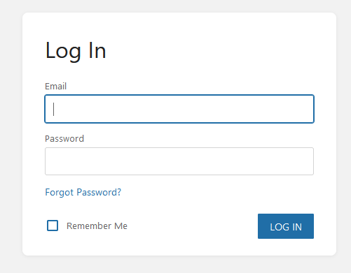

Bookstack is a simple, self-hosted, easy-to-use platform for organizing and storing information. Installing is quite simple as well.

## Prerequisites
- Docker and Docker Compose
- Machine Root access
- MySQL or MariaDB
    - Postgres will NOT work

You can find the latest Docker Compose at [https://hub.docker.com/r/linuxserver/bookstack](https://hub.docker.com/r/linuxserver/bookstack) with mine posted below. Since this is supported by a database, it can be a little tricky if you are wanting to use an already existing MySQL database. You may also substitute Docker Volumes for file paths if you so choose.

> This config file directly exposes passwords. You may want to use environment variables to hide secret variables.
{: .prompt-danger}

## Compose File
```yaml
version: "2"
services:
  bookstack:
    image: lscr.io/linuxserver/bookstack
    container_name: bookstack
    environment:
      - APP_URL=http://localhost:6875
      - DB_HOST=bookstack_db
      - DB_PORT=3306
      - DB_USER=<user>
      - DB_PASSWORD=<password>
      - DB_DATABASE=<database>
    volumes:
      - bookstack:/config
    ports:
      - 6875:80
    restart: unless-stopped
    depends_on:
      - bookstack_db
  
  bookstack_db:
    image: lscr.io/linuxserver/mariadb
    container_name: bookstack_db
    environment:
      - MYSQL_ROOT_PASSWORD=<rootpassword>
      - TZ=America/Denver
      - MYSQL_DATABASE=<database>
      - MYSQL_USER=<user>
      - MYSQL_PASSWORD=<password>
    volumes:
      - bookstack_db:/config
    restart: unless-stopped

volumes:
    bookstack:
        external: true
    bookstack_db:
        external: true

networks:
  default:
    name: bookstacknetwork
    external: false
```

## Finishing
Once the compose file is ran, you can find Bookstack at `<serverip>:6875` and you'll be greeted with the following page:

