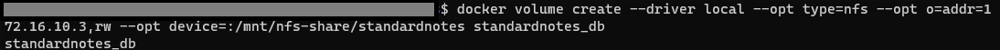

There are a few issues I've run into in my days of self-hosting. One of the most common is permissions issues. Usually, I run into these when I'm trying to use one of my NFS paths back to my NAS for persistent data storage with my containers.

As you may know, Docker allows containers to use files paths or volumes to store data for the container. File paths are the most commonly used in my environment for a variety of reasons:
1. I break into the path at any time and see the data that is there
2. It is easier for me to visualize the data heirarchy and how it is stored
3. ~~Docker volumes are only able to be created on the local device, not over a network share~~

I used to use file paths exclusively because I was under the impression that Docker volumes couldn't be created or accessed on a device that wasn't the host. Because of this, I didn't use volumes simply because I couldn't save that data anywhere else besides the host unless it was through a backup (which you should always do anyway).

### What I'm Covering
- How to create a persistent Docker volume that stored on another machine and accessed via NFS.
- Necessary changes you might need to make to your `docker-compose` files so that your containers take advantage of these changes.

### What I'm Skipping
- How to move your data into a Docker volume.

### Assumptions
- You have NFS installed and configured, and your file paths mounted on your device.
- You are able to read, write, and execute files from this NFS path.

:::note
While this guide will use examples from a MySQL container when using [Standard Notes](#), similar issues have been seen with other containers that were able to be resolved with this method.
:::

### Common Errors You Might Be Seeing
``` log
chown: changing ownership of '/var/lib/mysql': Operation not permitted
```

## Walkthrough
### CMD
#### Create Volume
:::caution
This must be done on the machine where the volume is going to be stored. For example, if you are on machine1 and want the volume to be stored on machine2, you would need to run these commands on machine2.

All of the following commands need to be run on the machine where the volume will be stored.
:::

First, let's create our Docker volume.

``` bash
docker volume create --driver local --opt type=nfs --opt o=addr=[ip-address],rw --opt device=:[path-to-directory] [volume-name]
```

Replace `[ip-address]`, `[path-to-directory]`, and `[volume-name]` with your values. Do not include the brackets on either end of these values.

For example,
``` bash
docker volume create --driver local --opt type=nfs --opt o=addr=172.16.10.2,rw --opt device=:/mnt standardnotes_db
```

You'll see your volume name printed as the output.



You can verify the volume by using the `docker volume ls` command. More information about the volume can be found by using the `docker volume inspect [VOLUME-NAME]` command.

I was initially confused by this command as it seems like the volume is just being created on the local device with the _option_ for NFS. However, that is not the case. Let's break it down.

- `docker volume create --driver local` creates the volume locally.
- `--opt type=nfs` defines that it is an NFS volume.
- `--opt o=addr=[ip-address],rw` defines _where_ this volume is located. In my case, it is stored at 172.16.10.2. The `rw` at the end specify its permissions, read and write.
- `--opt device=:[path-to-directory]` defines where on the local device this volume will be accessed. Most will put it in the `/mnt` directory, like I did.
- `[volume-name]` is the local name of the volume you want. In my case, "standardnotes_db".

Do keep in mind, the volume needs to be created on the host machine beforehand.

#### Mount via NFS
Next, we'll install the `nfs-common` package on our machine to enable NFS. You can skip this step if you already have NFS installed and configured.

``` bash
sudo apt update && sudo apt install nfs-common
```

:::note
Remember that these are the commands for distros that use `apt` as their package manager (Debian, Ubuntu). You may have to alter your commands and/or package for other package managers.
:::

#### Use the Volume
Now, we're going to run our container to use this new volume. Keeping in mind our values from earlier:

``` bash
docker run -d -it --name [container-name] --mount source=[volume-name],target=[path-to-directory] [image-name]
```

For example,
``` bash
docker run -d -it --name [standard-notes] --mount source=[standardnotes_db],target=[/mnt] standardnotes
```

## References
1. https://phoenixnap.com/kb/nfs-docker-volumes
2. https://www.reddit.com/r/selfhosted/comments/lkti7c/how_do_you_properly_attach_nfs_shares_to_docker/
3. https://sysadmins.co.za/create-a-docker-persistent-mysql-service-backed-by-nfs/